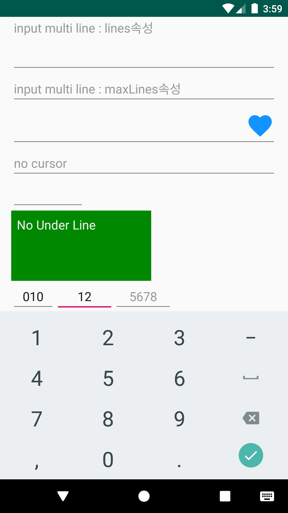

# Ex11EditText
안드로이드 네이티브 앱 개발 수업 예제#11

# 주요코드
EditText의 여러 속성과 기법 알아보기

- res폴더>>layout폴더안에 있는 activity_main.xml문서를 수정하여 화면제작
- inputType속성값 (text, number, phone, textPassword 등)에 따라 디바이스의 입력 소프트키패드가 다른 UI모양으로 보여짐
 > 지정이 없으면 엔터를 가진 키패드가 올라옴.(줄바꿈이 됨)- height값이 wrap이면 뷰가 커지고 수치값이면 안에 내용물이 안보이게 됨.
 
- 여러줄 입력 : inputType="textMultiLine" 및 ultiLine의 뷰 높이 관련속성 lines , maxLines
- EditText에 이미지 넣기 : drawableRight="@drawable/ic_favorite_black_40dp" ( 실습예제에 사용된 이미지는 AndroidStudio의 Image Asset메뉴를 통해 제작 )
- EditText 커서 안보이기 : cursorVisible="false"
- width를 글자수로 지정하기 : ems="5"
- background속성으로 배경을 지정하면 언더라인이 안보임. 즉, 언더라인이 EidText의 기본 배경이었던 것임
- EditText의 포커스 자동 이동 : Java 코드를 통한 커서 이동처리 필요함 (전화번호 입력폼에 유용한 기법)
- 기본적으로 화면에 EditText가 있으면 처을 실행할 때 자동으로 포커스를 가지게 됨. 이게 싫다면 ViewGroup(예제에서는 root의 LineaerLayout)에게 focusableInTouchMode="true"로 지정하면 EditText가 기본적으로 가지게 되는 Focus를 뺏어올 수 있음
- 소프트키패드 강제 보이기/숨기기/토글하기

# 실행모습

  <h4>inputType속성에 따라 다른 모양의 소프트키패드 [ text | number | phone | textPassword ]</h4>  
  
  
  
  
  

  <h4>EditText의 기타 속성들에 따른 실행모습</h4>
  
  
  
  
  

# 실행모습 GIF

  

